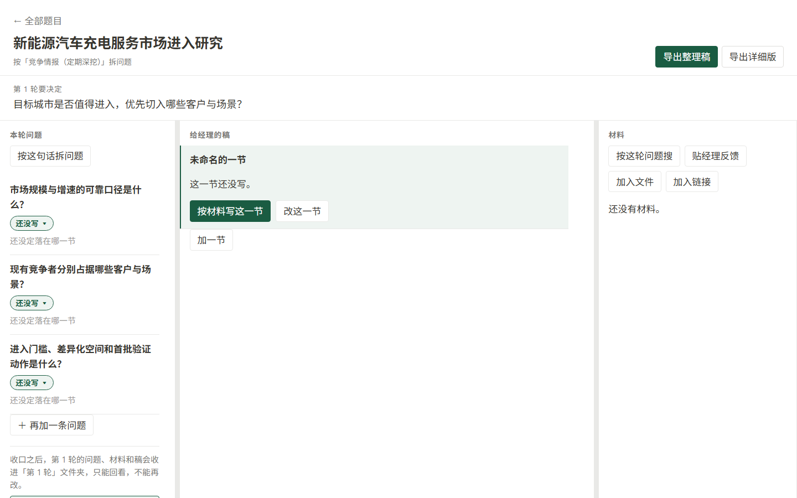

# 经纬｜咨询决策工作台

把咨询项目里的问题、材料、原话、判断和给经理的稿，放进一条可以回查的工作流。

[下载 Windows 版](https://github.com/hosheazhong-gif/jingwei-workbench/releases/latest) · [查看更新记录](CHANGELOG.md) · [参与开发](DEVELOPMENT.md)

## 经纬能帮你做什么

- 从经理的一句话任务开始，拆出这一轮真正要回答的问题。
- 按问题收集文件和网页材料，保留受控副本、来源与原话。
- 把事实、判断和待验证方向挂回具体稿件段落，不让结论失去出处。
- 让 AI 只生成候选问题或候选改稿；必须由人确认后才进入正式记录。
- 在信息不足时明确显示缺口、冲突和未核验数字，而不是补写成确定结论。
- 导出可继续修改的 Word、Markdown 和纯文本评审稿。

内置 7 类工作模板：产业链分析、商业尽调、竞争情报、产品功能对标、品牌定位对标、产业规划背景研究和战略事实基础。

## Windows 安装与启动

系统要求：Windows 10/11 64 位，以及一个现代浏览器。普通用户不需要安装 Python、Node.js 或数据库。

1. 打开 [Releases](https://github.com/hosheazhong-gif/jingwei-workbench/releases/latest)。
2. 下载最新的 `Jingwei-Windows-x64-v0.1.1.zip`。
3. 解压后双击 `Jingwei.exe`。
4. 经纬会自动打开浏览器；第一次使用时选择“新建题目”。

应用运行时会保留一个 Windows 提示窗：

- 选择“是”：重新打开工作台。
- 选择“否”：打开数据与导出目录。
- 选择“取消”：安全退出经纬。

当前安装包尚未购买代码签名证书，所以 Windows 可能显示“未知发布者”。请只从本仓库的正式 Release 下载，并可用 Release 中的 `.sha256` 文件核对下载内容。

## 一次典型使用

1. 新建题目，选择最接近的模板，写下经理原话和交付要求。
2. 确认本轮问题；每份材料都挂到它要回答的问题上。
3. 从材料快照中保存原话，再形成主张、判断或待验证方向。
4. 逐段修改给经理的稿，检查来源、数字、冲突和信息缺口。
5. 确认后导出整理稿或详细版 Word。

经纬不会因为选择了模板就自动生成完整报告。模板负责给出工作边界和参考问法，最终判断仍由使用者负责。

## 数据与隐私

- 数据库、材料副本和导出文件默认保存在 `%LOCALAPPDATA%\Jingwei`。
- 经纬只监听 `127.0.0.1:8765`，不会把工作台开放到局域网或公网。
- 建题、写稿、核验和导出不需要账号，也不需要 API Key。
- 只有在你主动使用网页搜索或配置模型能力时，相关请求才会访问外部服务。
- 升级或删除 `Jingwei.exe` 不会主动删除用户数据目录；重要项目仍建议定期备份该目录。

## 可选的模型能力

不配置模型也可以使用完整的人工工作流。若要使用“请模型先拟”：

1. 点击首页或工作台右上角的“连接模型”。
2. 选择 OpenAI、DeepSeek、Kimi、通义千问或智谱 GLM，粘贴对应的 API Key。
3. 点击“保存并测试”；显示连接成功后即可使用模型按钮。

也可以在“高级设置”中填写自定义的 OpenAI 兼容接口和模型名称。API Key 只保存在本机经纬数据目录，界面和读取接口不会回显；可随时在同一设置页删除。

## 当前版本的边界

- 单机、单用户，不包含团队账号、权限和实时协作。
- 浏览器是本机应用界面，不是云端网站。
- Word 为可编辑内部稿，不负责自动套用企业完整品牌模板。
- 网页搜索可能受到目标网站访问限制；候选链接必须由人打开确认后才能升为来源。
- 当前只提供 Windows x64 成品包；源码可在 Python 3.11+ 环境运行。

## 二次开发

项目保留完整运行源码、数据库迁移、前端、模板、测试和 Windows 打包脚本。开发环境、目录说明、测试与构建方式见 [DEVELOPMENT.md](DEVELOPMENT.md)。提交修改前请阅读 [CONTRIBUTING.md](CONTRIBUTING.md) 和 [SECURITY.md](SECURITY.md)。

## 反馈

遇到可复现的问题，请在 GitHub Issues 中说明 Windows 版本、操作步骤、预期结果和实际结果。不要上传客户资料、数据库、API Key 或未经脱敏的截图。

## 许可证

代码采用 [MIT License](LICENSE)，可以使用、修改和再发布；请保留原许可证与版权声明。
