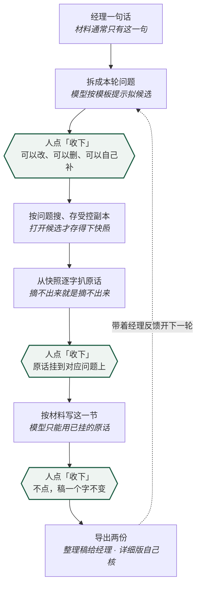

# 经纬 · 咨询决策工作台

经理丢来一句话，你去搜一堆材料，两天后交一份稿。半个月后他问：**「这个数是哪来的？」**

经纬就是为了让你答得上来。它把一次研究拆成「问题 → 材料 → 原话 → 判断 → 稿」五样东西，全部串在一条能倒查的链子上：稿里任何一句话，都点得回它出自哪份材料的哪句原文。

[下载 Windows 版](https://github.com/hosheazhong-gif/jingwei-workbench/releases/latest) · [更新记录](CHANGELOG.md) · [二次开发](DEVELOPMENT.md)

---

## 它跟「让 AI 帮我写份报告」有什么不一样

这是整个工具唯一重要的区别，先说清楚：

| | 让 AI 写报告 | 经纬 |
|---|---|---|
| 模型能用什么写 | 它知道的一切 | **只能用你已经挂上去的原话** |
| 写完算不算数 | 直接给你一篇 | **只是候选。你不点「收下」，稿一个字都不变** |
| 数字哪来的 | 通常说不清 | **每个数字单独一行，标出在哪条原话里找得到；找不到的标红** |
| 材料原文 | 被改写、被概括 | **逐字来自快照，一个字都不许改** |

**模型在这里不是作者，是助手。** 它替你拟问题、拟改稿，但每一步都要你点头才进账本。稿里没有一句话是「它自己知道的」。

---

## 一次研究长什么样

**三个绿框是人工闸门。** 模型永远停在闸门前面。

---

## 它替你盯着的事

写稿的时候，这些东西自动标出来——**只提示，不拦截**，收不收仍然是你的事：

- **没挂来源的数字**：正文里出现、但任何一条已挂原话里都找不到的数字，整行标红。
- **数字清单**：这一节每个数字单独一行，标明出自哪条原话。*对的是「这个数在原话里出不出现」，不是「这个数对不对」——挂上了也可能是材料本身写错。*
- **客户口头被写成已核实**：只有标明「客户提供」的原话才能写「据客户提供」。
- **经理反馈被当成外部证据**：那是内部指示，既不是客户口径也不是外部材料。
- **宏观数据被用来证明项目需求**：行业有多大，不等于这个项目缺什么。
- **稿里的重复**：同一个意思在好几条里换着说；小结照抄正文。
- **改一节会牵动哪几节**：这一版改掉的数字，别的小节还照旧写着老数——标红提醒。
- **补料之后哪一节该重看**：这一节收下之后又挂了几条原话。

---

## 七个模板：按哪类活来拆问题

模板决定「拆问题时给模型什么参考提示」和界面用词。**它不写问题、不写稿、不改核验**；建题目时选定，之后不再更换。

| 模板 | 干什么活 | 验到什么程度 |
|---|---|---|
| **产业链分析**（低信息售前研究） | 一句话起步，把政策、行业数据、标杆企业、产业链缺口一条条找齐 | 🟢 已在真题上走查过 |
| **商业尽调**（案头版） | 把投资逻辑拆成能验的命题，逐条看公开材料撑到哪 | 🟢 已在真题上走查过 |
| **竞品分析**（定位与主张对标） | 各家自己怎么说、面向谁、定价口径怎么设 | 🟡 真材料走通了 |
| **竞品分析**（产品与功能对标） | 功能逐项对照。**不做矩阵、不打分、不出雷达图** | 🟡 真材料走通了 |
| **竞争情报**（定期深挖） | 盯一家对手，定期出一份「这段时间发生了什么」 | 🟡 真材料走通了 |
| **产业规划**（背景与对标段） | 上位政策怎么定调、本地基础什么样、外地怎么对标 | 🟡 真材料走通了 |
| **战略咨询**（事实基础段） | 市场多大、谁在赢、客户为什么买 | 🟡 真材料走通了 |

**「验到什么程度」是认真的，不是装饰：**

- 🟢 **已在真题上走查过**——拿真实题目把整条循环从头走到尾跑过：拆问题、搜、扒原话、写稿、收下、导出。
- 🟡 **真材料走通了，模型那一步还没验**——七条参考问法拿真题逐条搜过（搜得到吗、重不重复、空不空），整条循环也用**真实公开材料**走通了：挂材料、逐字扒原话、写稿、收下、核验、导出，稿里每个数字都挂得住出处。**唯独「模型按这个模板拟问题和写稿」那一步是人代做的**——你在自己机器上接好模型、拿这个模板跑一道真题，就补齐了。

界面上打开「模板都是干什么的」，每个模板都有：适用与不适用、流程图、分步骤（每步带「做完的标志」）、一个完整案例、常见的坑，以及**七条参考问法各自的来处**。

**这几类活现在装不进来，写清楚免得你白试**：技术尽调（证据是代码和扫描结果）、组织与人力咨询（核心产出是编制表和测算）、市场研究的定量部分（要的是占比不是原话）、竞争情报的常年卡片维护（那是知识库的形状）。

---

## 挑材料时最容易踩的三样

这个工具的硬门槛是「原话必须逐字来自快照」。**但那道门槛挡不住来源本身是假的**——这三条写在界面里，也写在这儿：

1. **扒得出，但不是法定口径**：渠道商的 SEO 页常排在官方前面，页上真有价格和参数、也真能逐字扒。挂上去就是把渠道话术当成了官方定价。
2. **搜得到，但扒不出来**：有些平台搜索结果里到处都是，却挡爬虫，快照存不下正文。只能当线索。
3. **官网抓不到，不等于这家没有公开信息**：前端渲染的官网抓下来只有网页标签。要退到应用商店页或帮助中心，别记成「查无此项」。

---

## 安装

Windows 10/11 64 位 + 一个现代浏览器。**不需要装 Python、Node.js 或数据库。**

1. 打开 [Releases](https://github.com/hosheazhong-gif/jingwei-workbench/releases/latest)
2. 下载 `Jingwei-Windows-x64-v*.zip`
3. 解压，双击 `Jingwei.exe`
4. 浏览器会自动打开，点「新建题目」开始

运行时会留一个提示窗：**是**＝重新打开工作台，**否**＝打开数据与导出目录，**取消**＝退出。

> 安装包还没买代码签名证书，Windows 可能提示「未知发布者」。请只从本仓库的正式 Release 下载，并用 Release 里的 `.sha256` 核对。

---

## 五分钟上手

1. **新建题目**，选一个最接近的模板，把经理原话原样贴进去。
2. **点「按这句话拆问题」**，模型拟几条候选；改一改，点「收下」。
3. **按问题搜材料**：网页候选要点开才存得下受控副本；本机文件直接加进来。
4. **从快照里扒原话**，挂到对应的问题上。
5. **点「按材料写这一节」**，模型只用已挂的原话写一版候选。看一眼数字清单和检查提示，觉得行就点「收下」。
6. **导出**：整理稿给经理，详细版自己核对。

**选了模板不会自动生成报告。** 模板只给工作边界和参考问法，判断始终是你的。

---

## 数据与隐私

- 数据库、材料副本、导出稿都在 `%LOCALAPPDATA%\Jingwei`。
- 只监听 `127.0.0.1:8765`，不开放到局域网或公网。
- 建题、写稿、核验、导出**不需要账号，也不需要 API Key**。
- 只有你主动用网页搜索或配置了模型，才会有请求发到外部。
- 卸载或升级不会删你的数据目录；重要项目仍建议自己备份。

---

## 可选：接一个模型

不接模型也能用完整的人工流程。要用「请模型先拟」：

1. 点首页或工作台右上角的**「连接模型」**
2. 选 OpenAI / DeepSeek / Kimi / 通义千问 / 智谱 GLM，粘贴对应的 API Key
3. 点**「保存并测试」**，显示连接成功即可

也可以在「高级设置」里填自定义的 OpenAI 兼容接口。**API Key 只存在本机数据目录，界面和读取接口都不回显**，随时可以在同一页删掉。

---

## 这一版做不到什么

- 单机单用户。没有团队账号、权限、实时协作。
- 浏览器只是本机应用的界面，不是云端网站。
- Word 是可继续编辑的内部稿，不套用企业品牌模板。
- 不做计算：财务测算、加权评分、份额百分比都不做。
- 不做表和图：产出是文字稿。
- 网页搜索会被目标网站限制；候选链接必须人工打开确认才能升为来源。
- 成品包目前只有 Windows x64；源码可在 Python 3.11+ 下运行。

---

## 二次开发

完整源码、数据库迁移、前端、模板、测试和 Windows 打包脚本都在仓库里。见 [DEVELOPMENT.md](DEVELOPMENT.md)，提交前请读 [CONTRIBUTING.md](CONTRIBUTING.md) 和 [SECURITY.md](SECURITY.md)。

## 反馈

在 GitHub Issues 里说明 Windows 版本、操作步骤、预期结果和实际结果。**不要上传客户资料、数据库、API Key 或未脱敏的截图。**

## 许可证

[MIT License](LICENSE)。可以使用、修改、再发布，请保留原许可证与版权声明。
